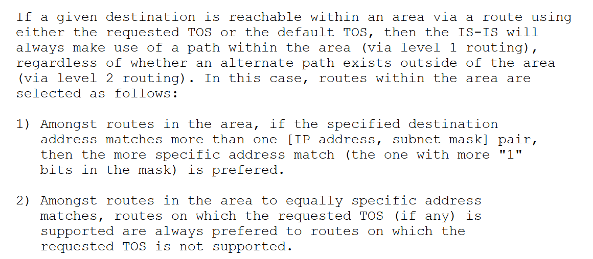
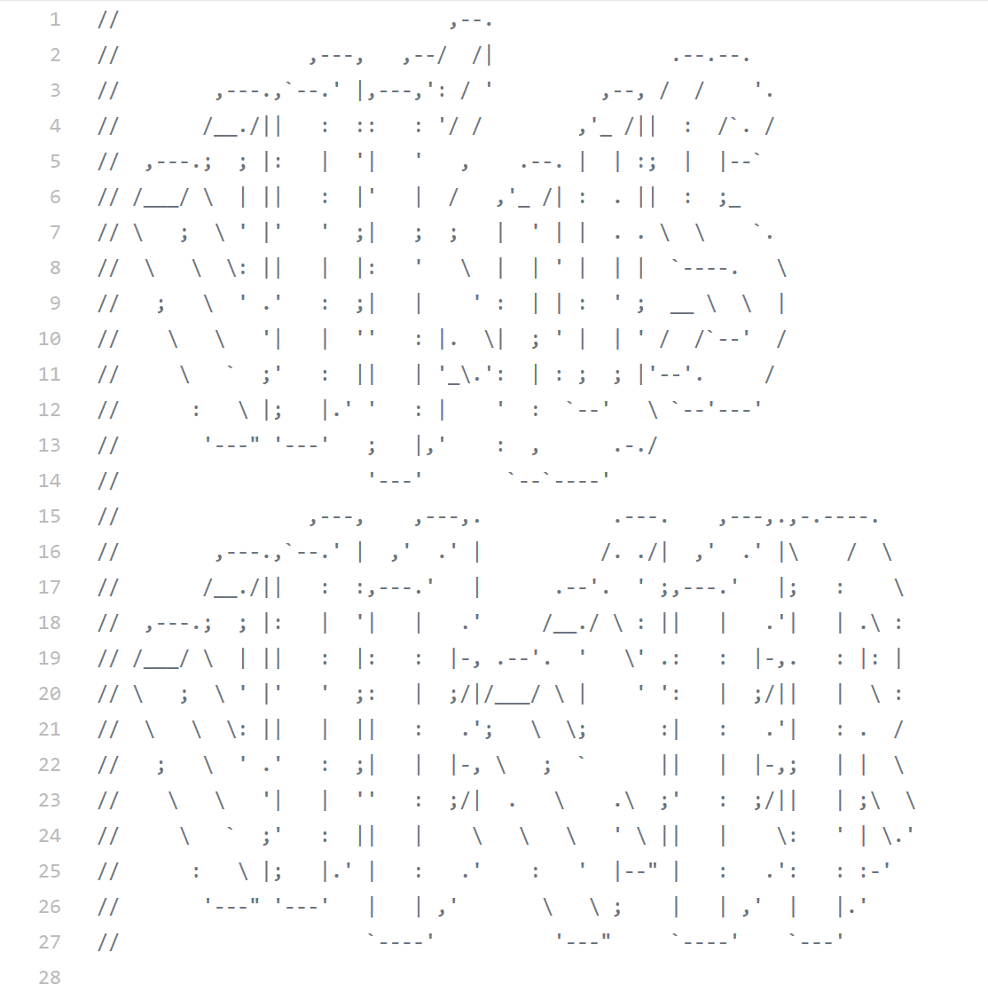

<!-- .element class="aligned-center title-page" -->

# Texte aufbereiten und publizieren mit Markdown und Pandoc 

---

## Tutorials

Tutorials, an denen sich dieses Tutorial orientiert:

- [Getting Started with Markdown](https://programminghistorian.org/en/lessons/getting-started-with-markdown)
- [Sustainable Authorship in Plain Text using Pandoc and Markdown](https://programminghistorian.org/en/lessons/sustainable-authorship-in-plain-text-using-pandoc-and-markdown)

...zum Selberausprobieren in einer ruhigen Minute...

---

## Text erstellen

Moderne Textprozessoren wie MS Word, Google Docs, OO Writer... 

- werden primär über eine GUI bedient
- bieten "WYSIWYG"
- haben einen großen Funktionsumfang
- stellen den "Industriestandard"
- sind (weitgehend) geschlossen
- sind ressourcenhungrig (schwergewichtig)
- haben eine fragliche Langzeitperspektive
- *verbergen das zugrundeliegende Textmodell*

---

## Text auszeichnen

Erscheinungsbild

_vs._

logische Struktur

- - -

Semantische Auszeichnung ~= logische Struktur

---

## Markdown

Markdown ist eine Konvention. 
(Quasi-Standard; kein Programm!)

Markdown definiert Regeln zur logischen Strukturierung von
"reinen" Textdateien.

Die Strukturen sind für Mensch und Maschine verständlich.

---

## Exkurs: Was ist eine Textdatei?

- Textdateien enthalten _nur Schriftzeichen_  (alphanum. Zeichen, Zeilenumbrüche, Sonderzeichen)
- Kodierung / _Zeichensatz_: ASCII, Latin1, **UTF-8**
- Die Endung ist häufig _`.txt`_
- Viele Formate sind eigentlich Textdateien: XML, HTML, Shell-Skript, ...
- Texteditoren: Notepad++, Atom, ...

- **Keine Formatierungsmöglichkeiten!?**

---

## Formatierung in Textdateien; :)

 <!-- .element style="width: 50%; display: inline;" -->
 <!-- .element style="width: 30%; display: inline;" -->

1. https://tools.ietf.org/html/rfc1195
2. https://github.com/cpietsch/vikus-viewer/blob/master/js/viz.js

---

## Warum Markdown? Warum Textdateien?

- Textmodell direkt sichtbar
- Reduzierung auf das Nötigste
- Werkzeug-unabhängig _und_ große Werkzeugauswahl
- leicht weiter- und wiederverwendbar
- zukunftssicher

---

## Alternativen

TEI: wissenschaftliche Aufbereitung von Texten

Latex: Professioneller Satz & Layout

BBCode, ...

...

---

## Varianten

Markdown ist nicht standardisiert. 
Es gibt verschiedenste Varianten/Flavors.

- Das ursprüngliche Markdown
- CommonMark
- [GitHub flavored Markdown](https://github.github.com/gfm/)
- ...

Gemeinsame Basis, viele "Extras"

---

## Probieren geht über Studieren

Es gibt zahlreiche Webseiten zum Ausprobieren von Markdown.

Wir wählen die [markdown-it demo](https://markdown-it.github.io/)

---

## Pandoc

[Pandoc](http://pandoc.org/) ist ein Programm.

Es wandelt Markdown (und weitere Formate) in eine Reihe anderer Formate um:
HTML, TEI, Latex, PDF, Word, ...

Pandoc ist Open Source.

Pandoc wird über die Kommandozeile bedient: 
`pandoc -o Ausgabedatei.Format markdown.md`

---

## Pandoc-Beispiel 

Diese Folien als...

1. [HTML](content.html): `pandoc -s -o content.html content.md`
2. [PDF](content.pdf): `pandoc --toc -o content.pdf content.md`
3. [Word](content.docx): `pandoc -o content.docx content.md` 

Und im Original: [Markdown](content.md)

---

## Anpassbarkeit

Pandoc versteht viele Formate:

`pandoc --list-input-formats` 
`pandoc --list-output-formats`

Pandoc kann weitreichend konfiguriert werden:

`pandoc --help`

Pandoc beachtet Metadaten für das Zieldokument.

---

## Pandoc selbst ausprobieren

Die Webseite von Pandoc bietet eine [Demo](https://pandoc.org/try/)

---

## Markdown, Pandoc und Git

Markdown: Text verfassen

Git: Versionieren und kollaborieren

Pandoc: Publikation erstellen

---

## Beispiel: Programming Historian

Lektionen des Programming Historian werden in Markdown verfasst und über
[GitHub verwaltet](https://github.com/programminghistorian/jekyll/tree/gh-pages/en/lessons).

